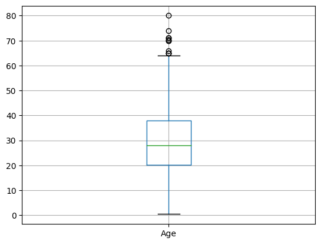

# Analyse

## Data set du Titanic

### :file_folder: Présentation du dataset

data set du titanic 

### Boxplot

|             | Type    |
|:------------|:--------|
| PassengerId | **int64**   |
| Survived    | **int64**   |
| Pclass      | **int64**   |
| Name        | **object**  |
| Sex         | **object** |
| Age         | **float64** |
| SibSp       | **int64**   |
| Parch       | **int64**   |
| Ticket      | **object**  |
| Fare        | `float64` |
| Cabin       | 
 object 
 |
| Embarked    | object  |

